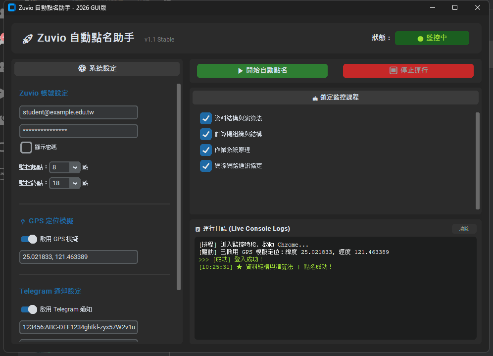

# 🚀 Zuvio Rollcall Bot (自動點名助手)

[](https://www.python.org/)
[](https://www.selenium.dev/)
[](https://github.com/TomSchimansky/CustomTkinter)
[](LICENSE)



本專案是一款專為 Zuvio 點名系統設計的自動簽到助手。支援**現代化 GUI 圖形介面**與**輕量 CLI 終端機模式**，採用多執行緒設計與強健的瀏覽器自動化技術，並支援 GPS 定位模擬與 Telegram 即時通知。非常適合放入求職履歷中，展現 Python 軟體開發、GUI 設計與自動化測試的整合實力。

---

## ✨ 核心特色與技術亮點

*   **🖥️ 雙模式啟動 (GUI / CLI)**
    *   **GUI 介面**：使用 `CustomTkinter` 打造深色主題現代化介面，提供流暢的動態狀態徽章與 Live Console 日誌渲染。
    *   **CLI 模式**：提供無頭 (Headless) 輕量運行模式，適合伺服器部署或背景自動排程。
*   **📍 CDP 地理位置模擬 (GPS Mocking)**
    *   透過 Chrome DevTools Protocol (CDP) 的 `Emulation.setGeolocationOverride` 繞過瀏覽器定位檢查。
    *   支援**十進位經緯度** (例如：`25.0218, 121.4633`) 與**度分秒 DMS** (例如：`25°01'18.6"N 121°27'48.2"E`) 雙格式自動正則解析。
*   **🏫 動態課程篩選監控**
    *   登入後自動抓取所有就讀課程，並在 GUI 畫面上渲染為核取方塊。
    *   使用者可即時剔除不需點名的課程，後端監控線程將自動同步篩選，節省網路頻寬與 CPU 資源。
*   **🔔 Telegram Bot 即時推播**
    *   整合 Telegram Bot API，在**點名成功**、**程式啟動**或**發生異常**時，即時發送手機推播通知與蜂鳴器警報。
*   **⚡ 線程安全與防卡死設計**
    *   將 Selenium 瀏覽器自動化與 GUI 主線程完全分離。
    *   使用 `queue.Queue` 進行線程安全的日誌與狀態更新，防止介面在執行 IO 密集任務時凍結。
*   **📦 強健的環境相容性與可攜性**
    *   **雙重驅動備份**：優先使用 Selenium 4 的 `Selenium Manager` 自動匹配本機 Chrome，失敗時降級使用 `webdriver-manager`。
    *   **動態執行路徑**：自動識別 PyInstaller 打包狀態 (`sys.frozen`)，確保設定檔 `settings.json` 與日誌一律儲存在執行檔同目錄下，支援「一鍵發送 exe」直接運行。

---

## 🛠️ 開發環境與依賴

*   **語言**: Python 3.8+
*   **主要依賴套件**:
    *   `selenium`: 瀏覽器自動化核心。
    *   `customtkinter`: GUI 框架。
    *   `webdriver_manager`: Chrome 驅動自動管理器。

### 安裝依賴

```bash
pip install -r requirements.txt
```

---

## 🚀 執行與使用方式

### 1. GUI 介面模式 (預設)

直接執行 `Zuvio.py`：

```bash
python Zuvio.py
```

*   **初次使用**：輸入 Zuvio 帳密與時段設定，點選「▶ 開始自動點名」會自動儲存設定並於背景啟動 Chrome。
*   **即時選取**：課程清單載入後，勾選想要監控的課程即可。

### 2. CLI 終端機模式

在終端機附加 `--cli` 參數啟動：

```bash
python Zuvio.py --cli
```

*   若無設定檔，系統會引導填寫帳密與 Telegram 配置，隨後進入無頭瀏覽器監控循環。

---

## 📦 打包發佈 (EXE 封裝)

專案內附一鍵打包腳本 `Compile.bat`，執行後將自動使用 PyInstaller 進行封裝：

```bash
.\Compile.bat
```

*   打包後的單一可執行檔將位於 `dist/Zuvio.exe`。
*   **分發說明**：分發給他人時**僅需傳送 `Zuvio.exe` 即可**。使用者的個人憑證與日誌會在執行時於同目錄自動建立，不會洩漏開發者的個人帳密。

---

## 🔒 隱私與安全說明

*   本專案的憑證檔 (`settings.json`) 與執行日誌 (`*.log`) 已被列入 `.gitignore`，確保提交代碼至 GitHub 時不會意外洩漏個人敏感資訊。
*   本腳本僅供自動化測試與技術交流使用，請遵守學校及平台的相關使用規範。
